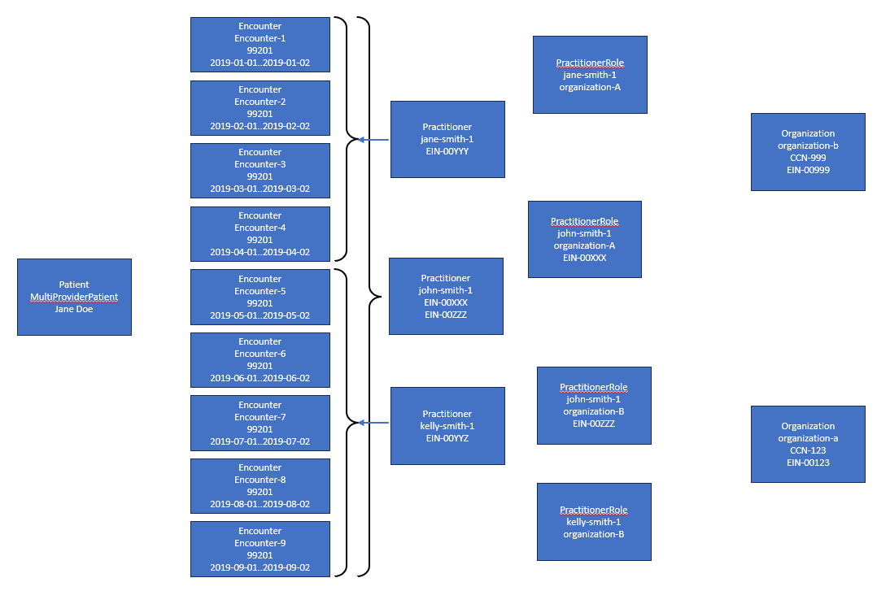

# ecqm-content-qicore-2023
eCQM Measure Content (Using QICore 4.1.1, based on FHIR R4 v4.0.1)

These draft FHIR-based measures and shared libraries are translated from the QDM-based versions of eCQMs to be published in May 2023 for the 2024 reporting year, and have specific versions, especially for the shared libraries, appropriate to the content for that publication update.

Commits to this repository will automatically trigger a build of the continuous integration build, available here:

https://build.fhir.org/ig/cqframework/ecqm-content-qicore-2023

## Connectathon Scenarios

### Measure Testing

This repository is populated with FHIR-based measure specifications developed using the MADiE tool and based on published AU2023 eCQMs. See the [Measure Content Index](https://docs.google.com/spreadsheets/d/1DocNOIX3ZYWCzOxSHw00sl21WHWx5SeazrlSCUcjqqs/edit#gid=1008487491) for a complete listing of available measure content for measure testing.

### Multi-Provider Patient Scenario

For systems that deal house data from multiple providers, it is often the case that individual patients may have encounters with multiple providers. In these cases, there must be a way to support identifying the data that should be reported with an individual based on the provider being reported. This is often referred to as the attribution of a patient (and their associated data for reporting) to a provider. Because attribution models vary based on where and why a measure is being evaluated (i.e. for what reporting program), attribution is not included as part of the measure specification. This means that currently, reporting systems must partition data differently when running the same measure for different programs. To support formal description of the attribution model, this scenario will look at ways to describe the attribution as part of the program, rather than as part of the measure itself.

The testing scenario we are using to support these investigations is as follows:



The patient, Jane Doe, has 9 encounters, one at the beginning of each month. The first four encounters are with practitioners Jane Smith and John Smith, practicing at Organization A with CCN `CCN-123` and TIN `EIN-00123`. The last five encounters are with practitioners Kelly Smith and John Smith, practicing at Organization B with CCN `CCN-999` and TIN `EIN-00999`.

To support identifying the provider being reported, use the `provider` parameter of the R5 [$evaluate-measure](https://hl7.org/fhir/measure-operation-evaluate-measure.html):

```
GET [base]/Measure/<measure-id>/$evaluate-measure?subject=Patient/MultiProviderPatient&periodStart=2023-01-01&periodEnd=2023-12-31&provider=Organization/organization-a
```

This provides the needed input to the attribution criteria to determine what data should be attributed to the provider for the given patient.

There are two test measures defined to support this scenario testing, a "hospital" encounter-based measure `MPPEncounterLevel`, and a "clinic" patient-based measure `MPPPatientLevel`.

### Terminology API Testing

### Artifact Manifest Testing

### Measure Narrative Review

## Authoring

To author content in this implementation guide, you can use the VS Code CQL Plugin. This plugin will enable you to author, validate, and execute FHIR-based eCQM content.

For instructions on setting up your environment to use the VS Code Plugin, see the [VS Code CQL Support Readme](https://github.com/cqframework/vscode-cql/blob/master/README.md)

Github Codespaces can also be used in this repository.

## Content Indexes

* [Libraries](https://build.fhir.org/ig/cqframework/ecqm-content-qicore-2023/libraries.html)
* [Measures](https://build.fhir.org/ig/cqframework/ecqm-content-qicore-2023/measures.html)
* [Artifact Summary](https://build.fhir.org/ig/cqframework/ecqm-content-qicore-2023/artifacts.html)

## Repository Structure

This repository is setup like any HL7 FHIR IG project but also includes the CQL files and test data which means the file structure will be as follows:

```
   |-- _genonce.bat
   |-- _genonce.sh
   |-- _refresh.bat
   |-- _refresh.sh
   |-- _updatePublisher.bat
   |-- _updatePublisher.sh
   |-- _updateCQFTooling.bat
   |-- _updateCQFTooling.sh
   |-- ig.ini
   |-- bundles
       |-- MAT
           |-- <bundle files>
       |-- measure
           |-- <bundles>
   |-- input
       |-- ecqm-content-qicore-2023.xml
       |-- cql
           |-- <library name>.cql
       |-- pagecontent
       |-- resources
           |-- library
               |-- <library name>.json
           |-- measure
               |-- <measure name>.json
       |-- tests
           |-- measure
               |-- <measure name>
                   |-- <test case patient id>
                       |-- <test case resource files>
                   |-- ...
       |-- vocabulary
           |-- valueset
```

## Extracting MAT Packages

The CQF Tooling provides support for extracting a MAT exported package into the
directories of this repository so that the measure is included in the published
implementation guide. To do this, place the MAT export files (unzipped) in a
directory in the `bundles\mat` directory, and then run the following tooling
command:

```
[tooling-jar] -ExtractMatBundle bundles\mat\[bundle-directory]\[bundle-file]
```

For example:

```
input-cache\tooling-cli-2.4.0.jar -ExtractMATBundle bundles\mat\CLONE124_v6_03-Artifacts\measure-json-bundle.json
```

## Refresh IG Processing

The CQF Tooling provides "refresh" tooling that performs the following functions:

* Translates and validates all CQL source files
* Packages CQL and ELM content in the corresponding FHIR resources
* Refreshes generated content for each knowledge artifact (Library, Measure, PlanDefinition, ActivityDefinition) including parameters, dependencies, and effective data requirements

Whenever changes are made to the CQL, Library, or Measure resources, run the `_refresh` command to refresh the implementation guide content with the new content, and then run `_genonce` to run the publication tooling on the implementation guide (the same process that the continuous integration build uses to publish the implementation guide when commits are made to this repository).
